# 🎰 SNU-TOTO

> **서울대학교 학생들을 위한 이벤트 베팅 플랫폼**

---

## 📖 프로젝트 소개

SNU-TOTO는 서울대학교 학생들이 다양한 학교 이벤트에 가상 포인트로 베팅하고, 친구들과 함께 예측의 재미를 즐길 수 있는 서비스입니다. 베팅이라는 흥미로운 요소를 통해 학교 행사에 학생들의 능동적인 참여를 유도합니다.

---

## � 팀원 소개

| 이름 | 역할 |
|------|------|
| **장정윤** | Frontend |
| **정민건** | Frontend |
| **강현구** | Backend |
| **양해울** | Backend |
| **한영웅** | Backend |

---

## 🛠️ 기술 스택

### Frontend
- **Framework**: React
- **Routing**: React Router DOM
- **Styling**: CSS
- **Deployment**: AWS S3, CloudFront

### Backend
- **Framework**: FastAPI
- **Database**: MySQL (with SQLAlchemy ORM)
- **Cache**: Redis
- **Migration**: Alembic
- **Authentication**: JWT, Argon2 (패스워드 해싱)
- **Real-time**: WebSocket
- **Deployment**: AWS EC2, RDS
- **Test**: pytest

### Infra
- **Containerization**: Docker, Docker Compose
- **Reverse Proxy**: Nginx

---

## 🗂️ERD
- **ERD 링크**: https://www.erdcloud.com/d/WhWihZ7TCyWtsezf6

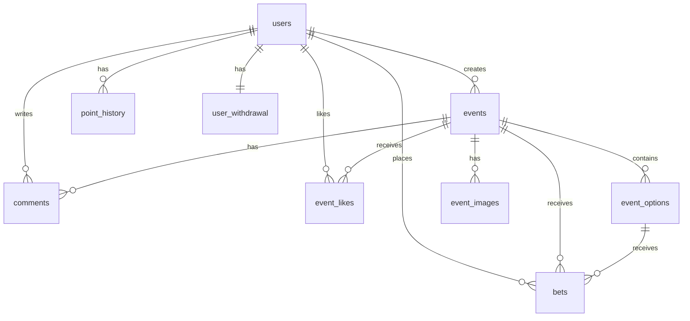

---

## ✨ 우리 조의 자랑거리

### 🎮 재미있는 서비스
- 친구들과 함께 다양한 학교 이벤트에 베팅하며 "도박의 짜릿함?"을 느껴보세요!
- 친구들과 공유할 수 있는 흥미로운 이벤트를 만들어보세요!

### 📊 실시간 배당률 변동
- **WebSocket**을 활용하여 베팅 현황에 따라 **배당률이 실시간으로 변동**되는 것을 확인할 수 있습니다.
- 베팅이 들어올 때마다 즉시 배당률이 업데이트되어, 사용자들이 역동적인 베팅 경험을 즐길 수 있습니다.

### 🏗️ 유연한 이벤트 구조
- 2개부터 10개까지 다양한 선택지를 지원하여, 승/패 예측부터 객관식 퀴즈까지 다양한 형태의 이벤트를 만들 수 있습니다.

---

## 🎯 서비스 이용 방법

### 1️⃣ 회원가입 & 로그인
- 서울대학교 메일(`@snu.ac.kr`)로 회원가입 후 이메일 인증을 완료하세요.
- Google 계정으로 간편하게 소셜 로그인도 가능합니다.
- 회원가입 시 **10,000 포인트**가 지급됩니다!

- **회원가입 페이지**
- 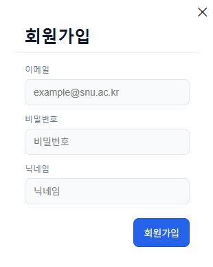

- **로그인 페이지**
- 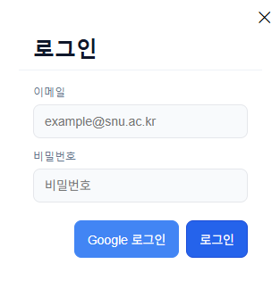

### 2️⃣ 이벤트 탐색 & 베팅
- 메인 화면에서 진행 중인 다양한 이벤트를 확인하세요.
- 마음에 드는 이벤트를 선택하고, 원하는 옵션에 포인트를 베팅하세요.
- 이벤트에 댓글을 달고 친구들과 의견을 나누세요!
- 베팅 현황에 따라 **배당률이 실시간으로 변동**됩니다!

- **이벤트 목록 조회 페이지**
- 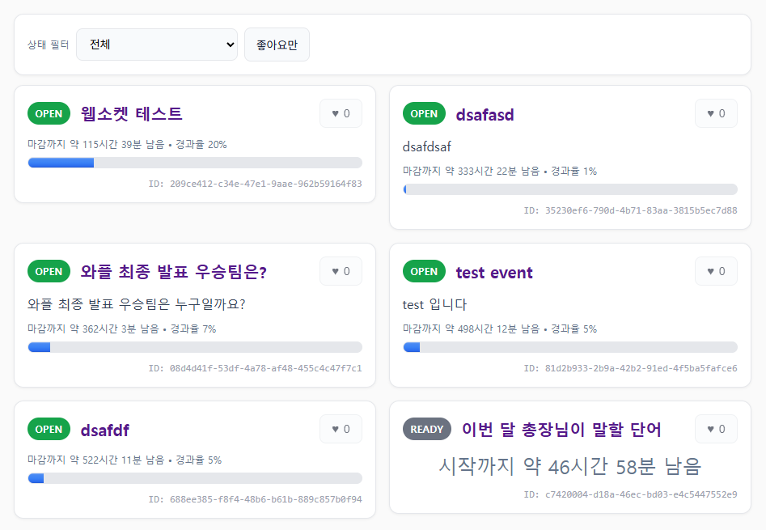

- **이벤트 상세 조회**
- 

- **베팅하기**
- 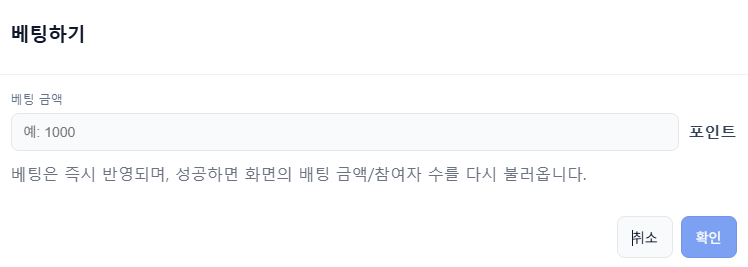

- **댓글 작성 및 조회 기능**
- 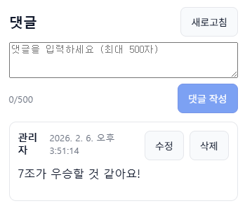


### 3️⃣ 이벤트 생성
- 직접 베팅 이벤트도 만들어 친구들과 공유할 수 있습니다.
- 제목, 설명, 선택지(2~10개), 시작/종료 시간을 설정하세요.
- 생성된 이벤트는 **READY 상태**로 대기하며, **좋아요를 많이 받아야 오픈**됩니다!

- **이벤트 생성 페이지**
- 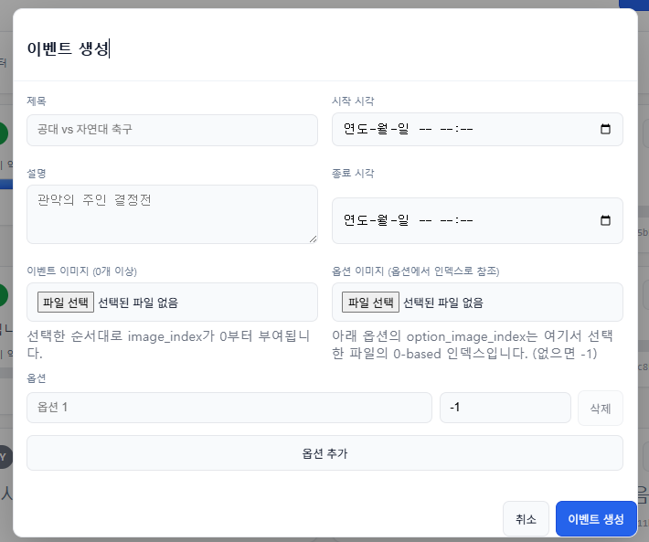

### 4️⃣ 결과 확인 & 정산
- 이벤트 종료 후 결과가 발표되면 자동으로 정산됩니다.
- 예측 성공 시 배당률에 따른 포인트를 획득합니다.
- 내 베팅 내역과 포인트 히스토리를 마이페이지에서 확인하세요.

- **정산된 이벤트**
- 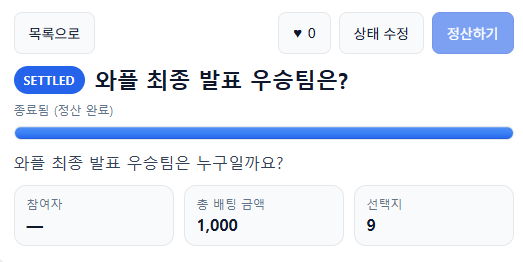

- **마이페이지**
- 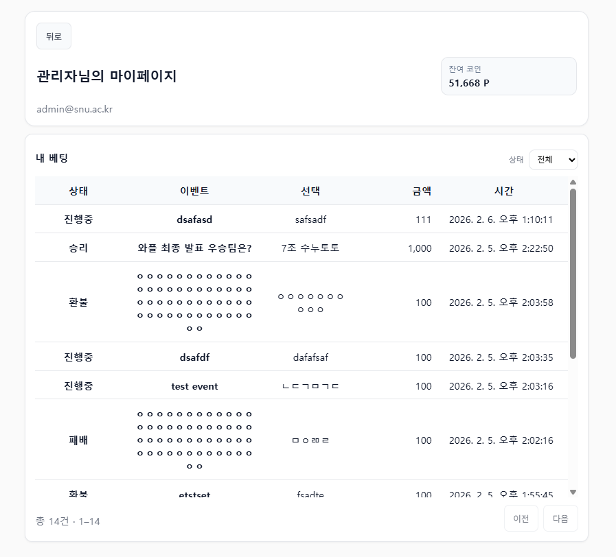

### 5️⃣ 랭킹 경쟁
- 포인트를 많이 모아 랭킹 상위권에 도전하세요!
- 친구들과 함께 누가 더 예측을 잘 하는지 겨뤄보세요.

- **랭킹 페이지**
- 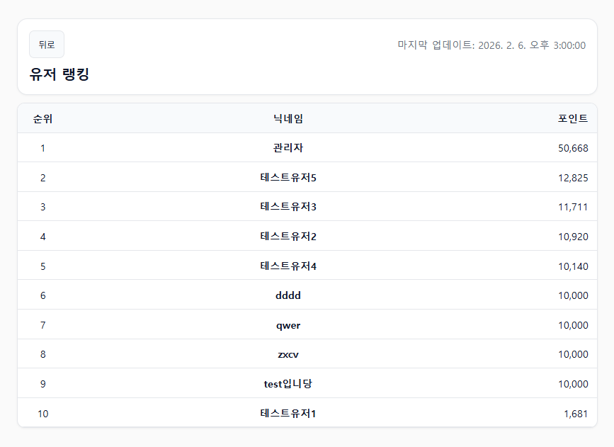
---

## 📊 배당률 시스템

### 배당률이란?
배당률은 베팅 성공 시 받게 되는 포인트의 배수입니다. 배당률이 **3.0배**인 옵션에 1,000포인트를 베팅하고 적중하면 **3,000포인트**를 획득합니다. (소수점 차이로 인해 단순 곱셈 결과와 실제 정산 금액이 다를 수 있습니다.)

### 배당률 계산 방식
```
배당률 = 전체 베팅 풀 / 해당 옵션 베팅 금액
```

#### 예시
| 옵션 | 베팅 금액 | 배당률 |
|------|----------|--------|
| A팀 승리 | 8,000P | 1.25배 |
| B팀 승리 | 2,000P | 5.00배 |
| **전체** | **10,000P** | - |

- A팀에 1,000P 베팅 후 적중 → **1,250P** 획득
- B팀에 1,000P 베팅 후 적중 → **5,000P** 획득

### 실시간 변동
- 다른 사용자가 베팅할 때마다 배당률이 **실시간으로 변동**됩니다.
- 인기 있는 옵션일수록 배당률이 낮아지고, 비인기 옵션일수록 배당률이 높아집니다.
- 베팅 시점의 배당률이 아닌, **정산 시점의 최종 배당률**이 적용됩니다.

### 복수 정답 처리
이벤트에 따라 **여러 옵션이 동시에 정답**이 될 수 있습니다.

#### 배당률 계산
```
배당률 = 전체 베팅 풀 / 정답 옵션들의 베팅 금액 합계
```

#### 예시
| 옵션 | 베팅 금액 |
|------|----------|
| A | 1,000P |
| B | 2,000P |
| C | 3,000P |
| **전체** | **6,000P** |

- **정답이 [A, B]인 경우:**
  - 정답 풀 = 1,000 + 2,000 = 3,000P
  - 배당률 = 6,000 / 3,000 = **2.0배**
  - A에 베팅한 사람: 베팅금액 × 2.0
  - B에 베팅한 사람: 베팅금액 × 2.0

> 💡 복수 정답의 경우, **모든 정답 옵션에 베팅한 사람들이 동일한 배당률**을 받습니다. 정답이 많을수록 정답 풀이 커져 배당률은 낮아집니다.

---

## 📝 이벤트 생성 규칙

### 기본 규칙
| 항목 | 조건 |
|------|------|
| **제목** | 5자 이상 100자 이하 |
| **선택지(옵션)** | 2개 이상 10개 이하, 이름 중복 불가 |
| **시작일** | 생성일 기준 **최소 2일 후** |
| **종료일** | 시작일 기준 **최소 1일 후** |

### 이벤트 상태 흐름
```
READY → OPEN → CLOSED → SETTLED
         ↓
     CANCELLED
```

| 상태 | 설명 |
|------|------|
| **READY** | 이벤트 생성 후 대기 상태 (좋아요 수집 기간) |
| **OPEN** | 베팅 가능한 상태 (시작일 도달 시 자동 전환) |
| **CLOSED** | 베팅 마감 (종료일 도달 시 자동 전환) |
| **SETTLED** | 결과 발표 및 정산 완료 |
| **CANCELLED** | 오픈 자격 미달로 취소됨 |

### 이벤트 오픈 자격 (is_eligible)
- 생성된 이벤트는 바로 오픈되지 않고, **READY 상태**로 대기합니다.
- **매일 20:00**에 시스템이 자동으로 인기 이벤트를 선정합니다.
- **좋아요가 많은 이벤트**가 오픈 자격(is_eligible)을 획득합니다.
- 시작일이 되었을 때:
  - ✅ 자격 있음 → **OPEN** 상태로 전환
  - ❌ 자격 없음 → **CANCELLED** 상태로 취소

> 💡 **Tip**: 이벤트를 만들었다면 친구들에게 좋아요를 받아 오픈 자격을 얻으세요!

---

## 🌿 Git 브랜칭 전략

**GitHub Flow** 방식을 사용합니다.

### 브랜치 명명 규칙

| 유형 | 접두사 | 예시 |
|------|--------|------|
| 기능 | `feat/` | `feat/predict-api` |
| 버그 | `fix/` | `fix/null-input` |
| 실험 | `experiment/` | `experiment/lstm-time` |
| 리팩토링 | `refactor/` | `refactor/model-loader` |
| 문서 | `docs/` | `docs/api-readme` |

---

## 📌 Git 커밋 컨벤션

### 커밋 메시지 형식
```
<태그>: <변경 내용>
```

### 작성 예시
```
feat: add social login with Google
fix: resolve crash on login page when password is empty
docs: README에 배당률 설명 추가
```

### 태그 종류

| 태그 | 의미 |
|------|------|
| **feat** | 새로운 기능 추가 |
| **fix** | 버그 수정 |
| **docs** | 문서 수정 (README 등) |
| **style** | 코드 의미에 영향 없는 스타일 변경 (들여쓰기, 세미콜론 등) |
| **refactor** | 코드 리팩토링 (기능은 그대로, 구조만 개선) |
| **test** | 테스트 코드 추가 및 수정 |
| **chore** | 빌드 업무, 패키지 매니저 설정 등 기타 작업 |

---

### 번외
- 도박 중독 상담
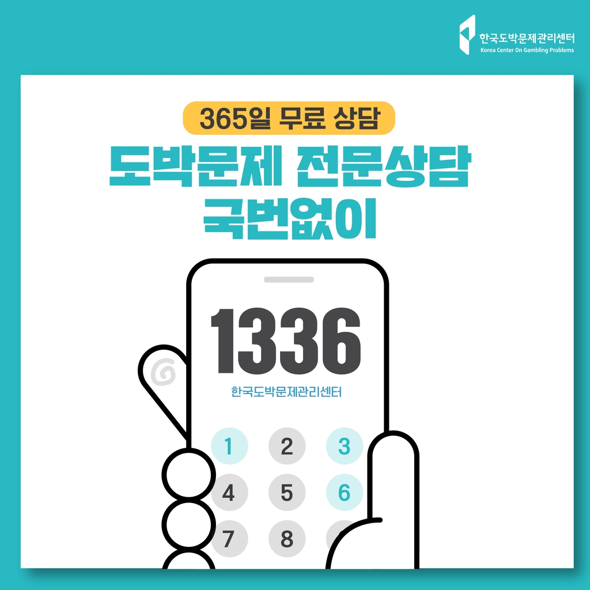

- 대출 상담
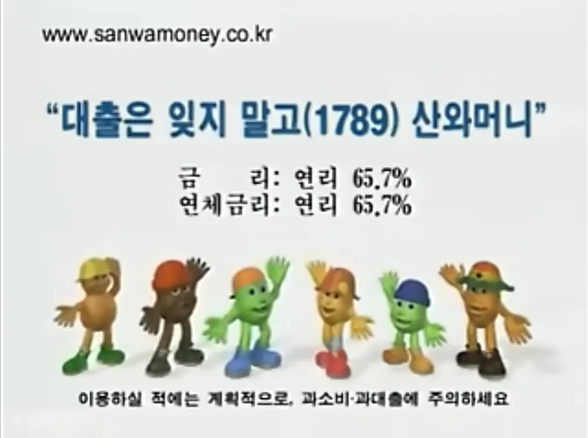
